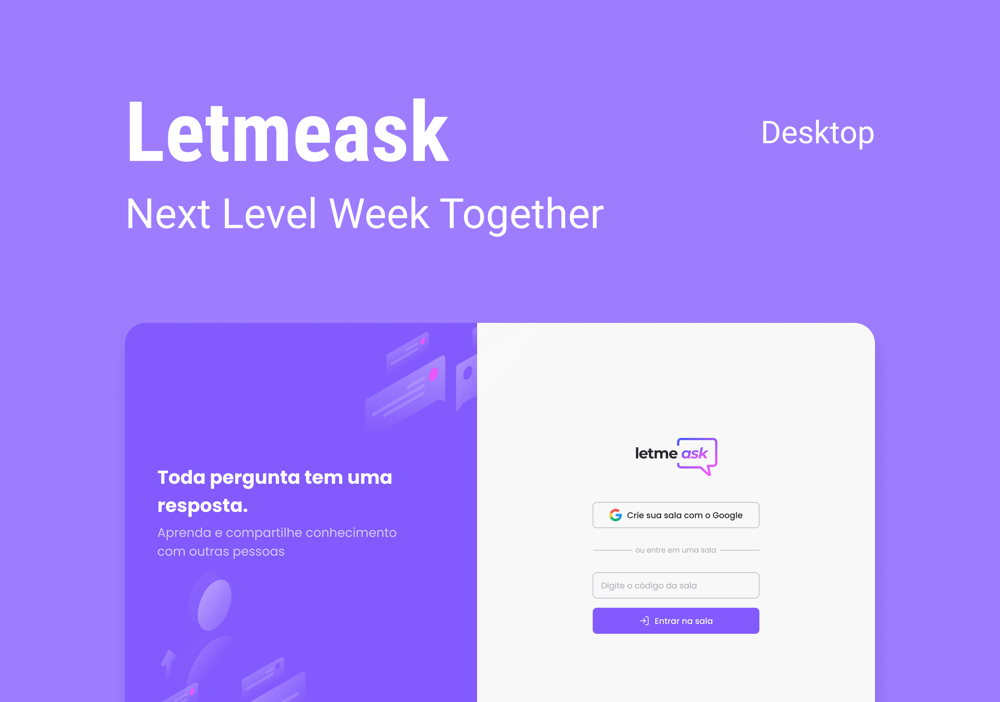

<h1 align="center">
  
</h1>

<p align="center">
  

 
</p>



## 💻 Projeto
Letmeask é perfeito para criadores de conteúdos poderem criar salas de Q&A com o seu público, de uma forma muito organizada e democrática. 

Este é um projeto desenvolvido durante a **[Next Level Week Together](https://nextlevelweek.com/)**, apresentada dos dias 20 a 27 de Junho de 2021.


## :hammer_and_wrench: Features 

-   [x] Disponibiliza a função de Logout.
-   [x] Exibe 'Toasters' para avisos.
-   [x] Abre o modal de confirmação nas ações de deletar pergunta e encerrar sala.
-   [ ] Refatoração de rotas.
-   [ ] Switch de Dark Mode.
-   [ ] Responsividade.
-   [ ] Opção para editar código da sala.
-   [ ] Filtro de perguntas.


## ✨ Tecnologias

- 
- 
- 
- 
- 
- 
- 


## 🔖 Layout

Você pode visualizar o layout do projeto pensado pela [Rebecca Gonzalez](https://dribbble.com/rebeccagonzalez) através [desse link](https://www.figma.com/file/u0BQK8rCf2KgzcukdRRCWh/Letmeask/duplicate). Lembrando que é necessário ter conta no [Figma](http://figma.com/) para acessá-lo.

## 🚀 Executando o projeto


Clone o projeto e acesse o diretório onde foi criado.

```bash
$ git clone https://github.com/ericknathan/letmeask.git
$ cd letmeask
```

Utilize o **yarn** ou o **npm install** para instalar as dependências do projeto.
Em seguida, inicie o projeto.

```bash
yarn start
```

Lembre-se de criar o seu App no Firebase para obter as credencias do Banco de Dados. Em seguida, defina no arquivo .env as configurações do seu App (remova o example do arquivo .env.example e adicionne .local).
 
 ```cl
REACT_APP_API_KEY=
REACT_APP_AUTH_DOMAIN=
REACT_APP_DATABASE_URL=
REACT_APP_PROJECT_ID=
REACT_APP_STORAGE_BUCKET=
REACT_APP_MESSAGING_SENDER_ID=
REACT_APP_APP_ID=
```

O app estará disponível para acesso em seu navegador em http://localhost:3000.

Lembrando que será necessário criar uma conta no [Firebase](https://firebase.google.com/) e um projeto para disponibilizar um Realtime Database.


## 📄 Licença

Esse projeto está sob a licença MIT. Veja o arquivo [LICENSE](LICENSE.md) para mais detalhes.

<br />